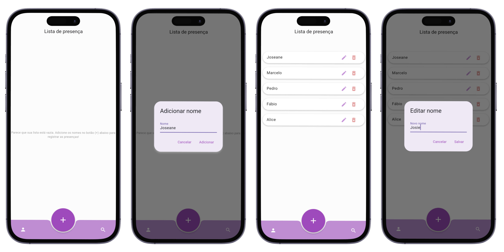
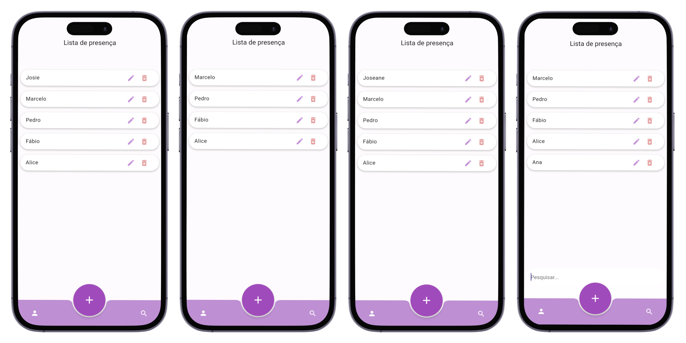

# Lista de presença
Uma lista de presença construída em Flutter, utilizando BloC para gerenciamento de estado.

Nessa lista você pode:

* Criar um nome;
* Editar um nome;
* Excluir um nome;
* Pesquisar um nome.

## Mockup e visão geral da aplicação:

